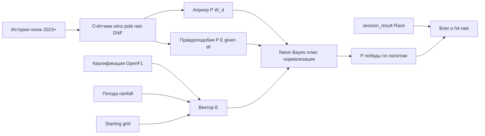
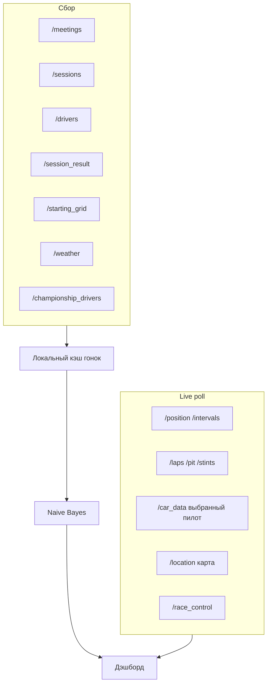

# План: F1 Bayes Predictor (Flutter + OpenF1)

Текущий проект [`f1_app`](C:\Users\anufr\flutter_projects\f1_app) — пустой шаблон: в [`lib/main.dart`](lib/main.dart) нет `MyApp`, зависимостей нет. Приложение пишем с нуля в этом репозитории, платформы уже есть (Windows, Android, iOS, Web).

## Алгоритм (обязательно): Naive Bayes + формула Байеса

Это не ML-нейросеть и не «магический рейтинг». Классический **наивный байесовский классификатор** для взаимоисключающих гипотез «пилот *d* победит», с **сглаживанием Лапласа (Дирихле)** и **нормализацией по сетке**. После каждой гонки счётчики обновляются — это **последовательное байесовское обучение**.

Гипотеза: \(W_d\) — пилот *d* выиграет гонку. Наблюдения перед стартом:

- \(Q\): квалификация / поул (`pole` / не поул; плюс корзина стартовой позиции: `1`, `2–3`, `4–10`, `11+`)
- \(R\): погода (`rain` если `rainfall > 0`, иначе `dry`)
- \(L\): сценарий «сход лидера» (исторический фактор и what-if на дэшборде; до старта неизвестен)

**Теорема Байеса:**

\[
P(W_d \mid E) = \frac{P(E \mid W_d)\, P(W_d)}{P(E)}
\]

**Наивное предположение** (независимость признаков):

\[
P(E \mid W_d) = P(Q \mid W_d)\, P(R \mid W_d)\, P(L \mid W_d)
\]

**Априор** из истории (2023+), сглаживание \(\alpha = 1\):

\[
P(W_d) = \frac{wins_d + \alpha}{N_{races} + \alpha \cdot N_{drivers}}
\]

Опционально смешиваем с формой чемпионата: \(P_{form} \propto points\_start\) из `/championship_drivers`.

**Правдоподобия** (частоты по прошлым этапам):

\[
P(Q=q \mid W_d) = \frac{\#(wins_d \land Q=q) + \alpha}{\#wins_d + \alpha \cdot |Q|}
\]

Аналогично для дождя и схода лидера. Если у пилота 0 побед — сглаживание всё равно даёт ненулевую вероятность (важно для новичков).

**Нормализация** (победа взаимоисключающа: ровно один победитель):

\[
\hat{P}(W_d \mid E) = \frac{P(W_d)\, P(E \mid W_d)}{\sum_j P(W_j)\, P(E \mid W_j)}
\]

На экране пилота отдельно показываем условные частоты из ТЗ (это диагностика модели, не финальный прогноз):

- \(P(\text{подиум} \mid \text{поул})\)
- \(P(\text{подиум} \mid \text{дождь})\)
- \(P(\text{победа} \mid \text{сход лидера})\)

Счёт в логарифмах, чтобы не было underflow: \(\log P(W_d) + \sum \log P(E_k \mid W_d)\), затем softmax.

**Точность прогнозов** после финиша:

- Top-1: совпал ли пилот с max \(\hat{P}\)
- Top-3 coverage: победитель в тройке фаворитов
- **Brier score** \(\sum_d (\hat{p}_d - \mathbf{1}_{d=winner})^2\) — стандартная метрика вероятностных прогнозов

Реализация: чистый Dart-модуль [`lib/domain/bayes/naive_bayes_predictor.dart`](lib/domain/bayes/naive_bayes_predictor.dart) без UI, с юнит-тестами на синтетических счётчиках.

## Данные OpenF1 (`https://api.openf1.org/v1`)

История с 2023 бесплатна без ключа. Live — по подписке; в коде всегда есть fallback: `session_key=latest` / последняя завершённая гонка / **replay** исторической сессии, чтобы дэшборд можно было показывать без оплаты.

**Нужны для модели (обязательно):**

- `/meetings?year=` — календарь, трасса, флаг, `circuit_image`, даты
- `/sessions?year=&session_name=Race|Qualifying` — ключи сессий
- `/drivers?session_key=` — имя, номер, команда, цвет, `headshot_url`
- `/session_result?session_key=` — финиш, подиум, `dnf`/`dns`/`dsq`, победитель
- `/starting_grid?session_key=` — поул и стартовая позиция (ключ **гонки**, не квалификации)
- `/weather?session_key=` — `rainfall`, температуры, влажность, ветер
- `/championship_drivers?session_key=` — `points_start`, `position_start` как априор формы

**Нужны для live-дэшбордов как на референсах:**

- `/position` — текущий порядок
- `/intervals` — gap to leader / interval (только гонка)
- `/laps` — текущий круг, best lap, сектора
- `/pit` — последний пит-стоп
- `/stints` — состав резины (`compound`), возраст шины
- `/car_data` — скорость, throttle, brake, rpm, DRS, передача (реже, не 3.7 Гц на всех)
- `/location` — x/y для карты трассы (прореживать)
- `/race_control` — флаги, SC/VSC
- `/championship_teams` — кубок конструкторов
- `/team_radio` — опционально, список записей

**Не тянуть в прогноз и не спамить в live:** сырой поток `car_data`/`location` на 20 машин без фильтра — это мегабайты. Для live: poll `position`+`intervals`+`weather` раз в 1–2 с; `laps`/`pit`/`stints` раз в 5 с; `car_data` только выбранного пилота; `location` с `date>` последней точки.

**Чего в OpenF1 нет** (на референсах есть — показываем «n/a» или не рисуем, без фейковых цифр): давление/температура шин, топливо, ERS. «Next pitstop» можно оценить эвристикой по возрасту стинта, явно подписав что это оценка.

Ограничения API: фильтры `=`, `>=`, `<=`, `>`, `<`; `meeting_key=latest`, `session_key=latest`; CSV не нужен.

## Что будет в приложении

Адаптивный UI: **десктоп = боковой nav как на 1-м скрине**, **телефон = нижняя навигация + тайминг как на 2–3**. Тема: тёмный pit-wall, акценты команд из `team_colour`. Язык: **RU/EN** (`flutter_localizations` + ARB).

**Экраны:**

1. **Dashboard** — следующая/текущая гонка, погода, поул, топ-5 \(\hat{P}(win)\), точность модели, карточка лидера.
2. **Live / Tracker** — порядок, гэпы, круг, резина, флаги; на десктопе сетка виджетов (квалка, карта, inputs выбранного пилота); на мобилке — speed/gap выбранного + таблица пелотона.
3. **Predictions** — все пилоты, % победы, вклад признаков (поул / дождь / сетка), переключатель what-if «сход лидера».
4. **Drivers / Constructors** — чемпионат OpenF1 + исторические условные вероятности.
5. **Races** — календарь meetings, архив прогнозов vs факт.
6. **Accuracy** — Brier, hit-rate, график по этапам.
7. **Settings** — язык, replay vs live, сезон.

Навигация десктопа совпадает с референсом: Dashboard, Cars (выбранный пилот + car_data), Weather, Tracker, Grid, Drivers, Constructors, Races.

## Архитектура кода

Слойная структура, расчёты отдельно от UI:

- [`lib/data/openf1/`](lib/data/openf1/) — Dio-клиент, DTO, маппинг
- [`lib/data/cache/`](lib/data/cache/) — Hive: история гонок, последние прогнозы, метрики (офлайн)
- [`lib/domain/bayes/`](lib/domain/bayes/) — счётчики, predictor, Brier
- [`lib/features/...`](lib/features/) — экраны по фичам
- Riverpod — состояние сессии, прогноза, live-polling
- `go_router` — маршруты desktop/mobile
- `fl_chart` — вероятности и accuracy
- LayoutBuilder / NavigationRail vs NavigationBar

Поток прогноза перед гонкой:

1. Найти ближайший `meeting` (дата ≥ сейчас) или `latest`.
2. Дождаться qualifying `session_result` и/или `starting_grid` гонки.
3. Взять `weather` квалификации / FP3 (`rainfall`).
4. Посчитать \(\hat{P}(W_d \mid E)\) и сохранить снимок прогноза.
5. После `session_result` Race — сравнить с фактом, обновить счётчики модели.

## Этапы разработки

1. Каркас: тема, i18n RU/EN, адаптивный shell, роутинг. Починить `main.dart`.
2. OpenF1 client + кэш meetings/sessions/drivers/results/grid/weather за 2023–текущий сезон.
3. Сбор признаков гонки + Naive Bayes + тесты на формуле и нормализации \(\sum p = 1\).
4. Экран прогноза (список пилотов, %) и экран точности.
5. Desktop dashboard + mobile timing/live (poll + replay).
6. Карта трассы по `/location` (упрощённый scatter на `circuit_image`).
7. What-if (дождь / сход лидера) и подписи вкладов признаков.
8. Проверка Windows + Android (или Chrome), пустые/ошибочные состояния API.

## Риски

- Мало побед у середняков → без Лапласа вероятности будут 0; сглаживание обязательно.
- OpenF1 только с 2023 — короткая выборка, модель честно слабая, это нормально для курсовой.
- Live без подписки может не идти — replay обязателен для демо.
- `starting_grid` появляется после официальной публикации, до этого берём порядок квалификации.
